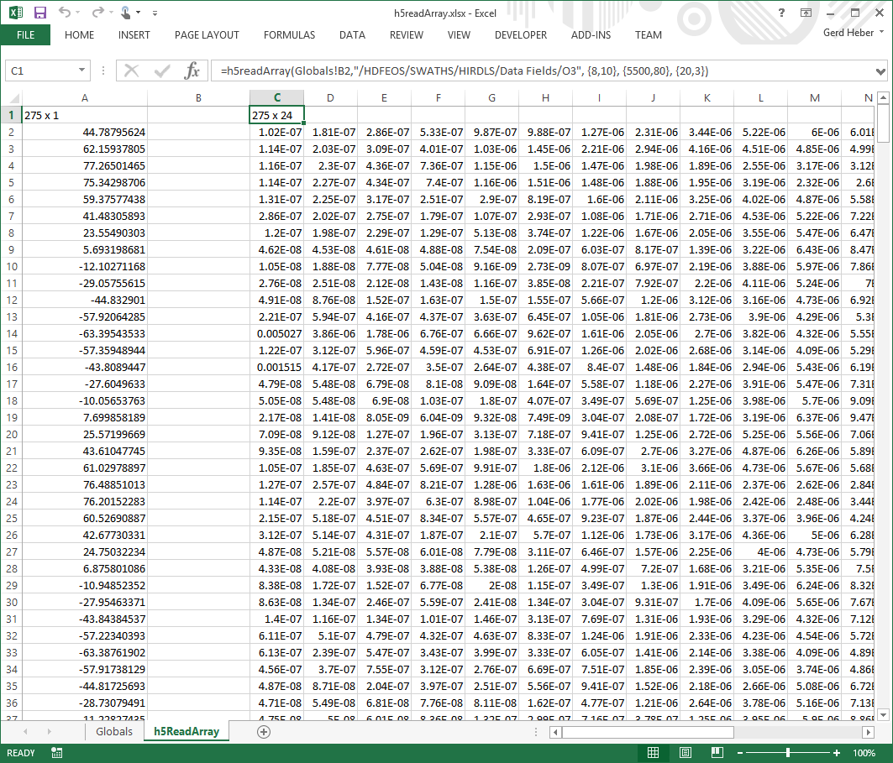

.. _h5readArray:

Reading Arrays: ``h5readArray``
-------------------------------

``h5readArray`` reads elements of one- and two-dimensional HDF5 arrays.
There are variants for reading all elements, a contiguous rectilinear
subset (hyperslab), or a strided rectilinear subset of an :term:`HDF5 array`.

.. _fig-h5readArray:

   An Excel `h5readArray` screenshot.

.. rubric:: Excel UDF Syntax

::

  h5readArray(filename, arrayname)

  h5readArray(filename, arrayname [, first, last, step])

  
.. rubric:: Mandatory Arguments

+-------------+---------------------------------------------------------------+
|Argument     |Description                                                    |
+=============+===============================================================+
|``filename`` |A text string specifying the name of an HDF5 file              |
+-------------+---------------------------------------------------------------+
|``arrayname``|A text string (path) specifying the location of an HDF5 array  |
+-------------+---------------------------------------------------------------+

.. rubric:: Optional Arguments

+---------+-------------------------------------------------------------------+
|Argument |Description                                                        |
+=========+===================================================================+
|``first``|An integer array specifying the position of the first element to   |
|         |be read                                                            |
+---------+-------------------------------------------------------------------+
|``last`` |An integer array specifying the position of the last element to be |
|         |read                                                               |
+---------+-------------------------------------------------------------------+
|``step`` |An integer array specifying the number of positions to skip in     |
|         |each dimension for each element read                               |
+---------+-------------------------------------------------------------------+

.. note:: The optional arguments are integer arrays whose length must be equal
	  the rank (number of dimensions)
	  of the HDF5 array.

   
.. rubric:: Return Value

On success, ``h5readArray`` populates a cell range with the requested
elements.

On error, an error message (string) is returned.

.. rubric:: Examples

Read all elements of the ``Tot_Precip_Water`` array.

::

   h5readArray("GSSTF.2b.2008.01.01.he5", \
               "/HDFEOS/GRIDS/SET2/Data Fields/Tot_Precip_Water")
   
Read only every other element of the two-dimensional ``Tot_Precip_Water``
array.

::

   h5readArray("GSSTF.2b.2008.01.01.he5", \
               "/HDFEOS/GRIDS/SET2/Data Fields/Tot_Precip_Water", , , {2,2})

Read a contiguous rectangular region of the ``Tot_Precip_Water`` array.

::

   h5readArray("GSSTF.2b.2008.01.01.he5", \
               "/HDFEOS/GRIDS/SET2/Data Fields/Tot_Precip_Water", \
	       {25,10}, {356, 89})

.. rubric:: Error Conditions
	    
The following conditions will create an error:

1. An invalid file name
   
   * An empty string or a string that contains characters not supported by
     the operating system
   * It refers to a file system location for which the user has insufficient
     access privileges
     
2. An invalid array name
   
   * An empty string
   * No HDF5 object exists at the specified location
   * The HDF5 object at the specified location is not an HDF5 array

3. The number of elements requested exceeds the maximum Excel row
   or column count
     
4. An invalid first position

   * The position is not empty and not an array of non-negative integers

5. An invalid last position

   * The position is not empty and not an array of non-negative integers
       
6. An invalid step

   * The position is not empty and not an array of positive integers

.. rubric:: See Also

:ref:`h5readTable <h5readTable>`, :ref:`h5readAttribute <h5readAttribute>`,
:ref:`h5readImage <h5readImage>`
