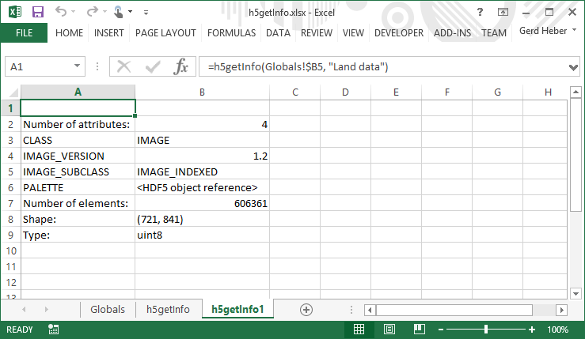

.. _h5getInfo:

Item Details: ``h5getInfo``
---------------------------

``h5getInfo`` displays detailed information about an HDF5 item in an
HDF5 file. The specifics depend on the kind of HDF5 item, such as
HDF5 group, dataset, or external link.

.. _fig-h5getInfo:

   Excel `h5getInfo` screenshot.

.. rubric:: Excel UDF Syntax

::

  h5getInfo(filename, location)

  
.. rubric:: Mandatory Arguments

+------------+---------------------------------------------------------------+
|Argument    |Description                                                    |
+============+===============================================================+
|``filename``|A text string specifying the name of an HDF5 file.             |
+------------+---------------------------------------------------------------+
|``location``|A text string (path) specifying the location of an HDF5 object |
+------------+---------------------------------------------------------------+

.. rubric:: Return Value

On success, ``h5getInfo`` populates a range of cells with detailed information
about an HDF5 object.

On error, an error message (string) is returned.

.. rubric:: Examples

Display detailed information about the HDF5 object at location
``/HDFEOS/SWATHS/HIRDLS/Geolocation Fields/Pressure`` in file ``file.he5``.

::
   
   h5showTree("file.he5", "/HDFEOS/SWATHS/HIRDLS/Geolocation Fields/Pressure")

.. rubric:: Error Conditions
	    
The following conditions will create an error:

1. An invalid file name
   
   * An empty string or a string that contains characters not supported by
     the operating system
   * It refers to a file system location for which the user has insufficient
     access privileges
     
2. An invalid location
   
   * An empty string
   * No HDF5 object exists at the specified location

.. rubric:: See Also

:ref:`h5showList`, :ref:`h5showTree`
