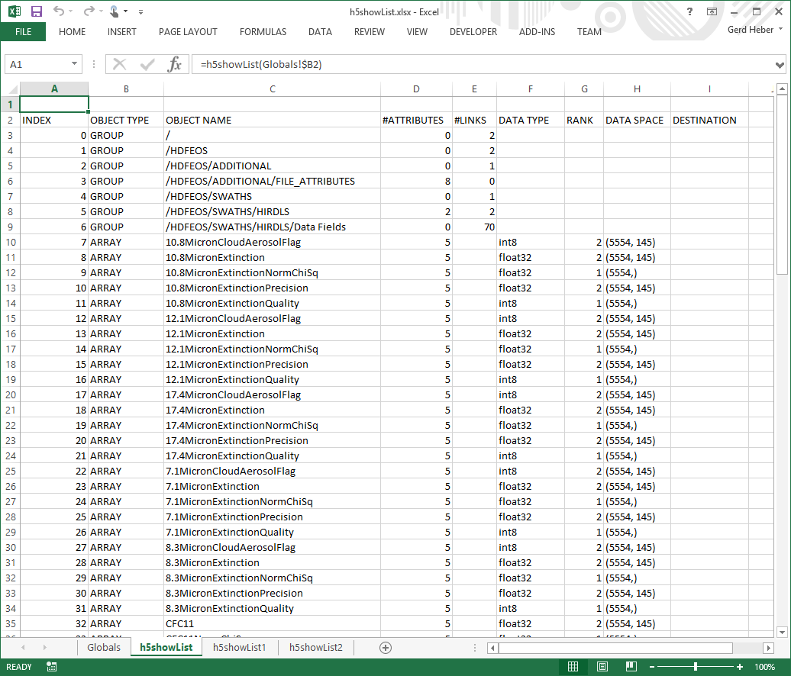

.. _h5showList:

A Tabular View: ``h5showList``
------------------------------

``h5showList`` displays the contents of an HDF5 file in *tabular* form. If no
alternative location is specified, starting at the HDF5 root group,
all HDF5 objects in the HDF5 file are visited recursively.
HDF5 objects are clustered by their "parent HDF5 group", and object
properties, such as HDF5 attribute count, are shown in cells to the right.
The specifics displayed depend on the HDF5 object kind.

.. _fig-h5showList:

   Excel `h5showList` screenshot.

.. rubric:: Excel UDF Syntax

::

  h5showList(filename)

  h5showList(filename [, location])

.. rubric:: Mandatory Arguments

+------------+------------------------------------------------------------+
|Argument    |Description                                                 |
+============+============================================================+
|``filename``|A text string specifying the name of an HDF5 file.          |
+------------+------------------------------------------------------------+

.. rubric:: Optional Arguments

+------------+------------------------------------------------------------+
|Argument    |Description                                                 |
+============+============================================================+
|``location``|A text string (path) specifying where to begin the traversal|
+------------+------------------------------------------------------------+

.. rubric:: Return Value

On success, ``h5showList`` populates a range of cells with different
HDF5 object properties in tabular form.

On error, an error message (string) is returned.

.. rubric:: Examples

Display in table form information about the HDF5 objects in file ``file.h5``,
beginning traversal at location ``/HDFEOS/GRIDS/SET2/Data Fields``.

::
   
   h5showList("file.h5", "/HDFEOS/GRIDS/SET2/Data Fields")

.. rubric:: Error Conditions

The following conditions will create an error:

1. An invalid file name
   
   * An empty string or a string that contains characters not supported by
     the operating system
   * It refers to a file system location for which the user has insufficient
     access privileges
     
2. An invalid location
   
   * An empty string
   * No HDF5 object exists at the specified location

.. rubric:: See Also

:ref:`h5getInfo <h5getInfo>`, :ref:`h5showTree <h5showTree>`
