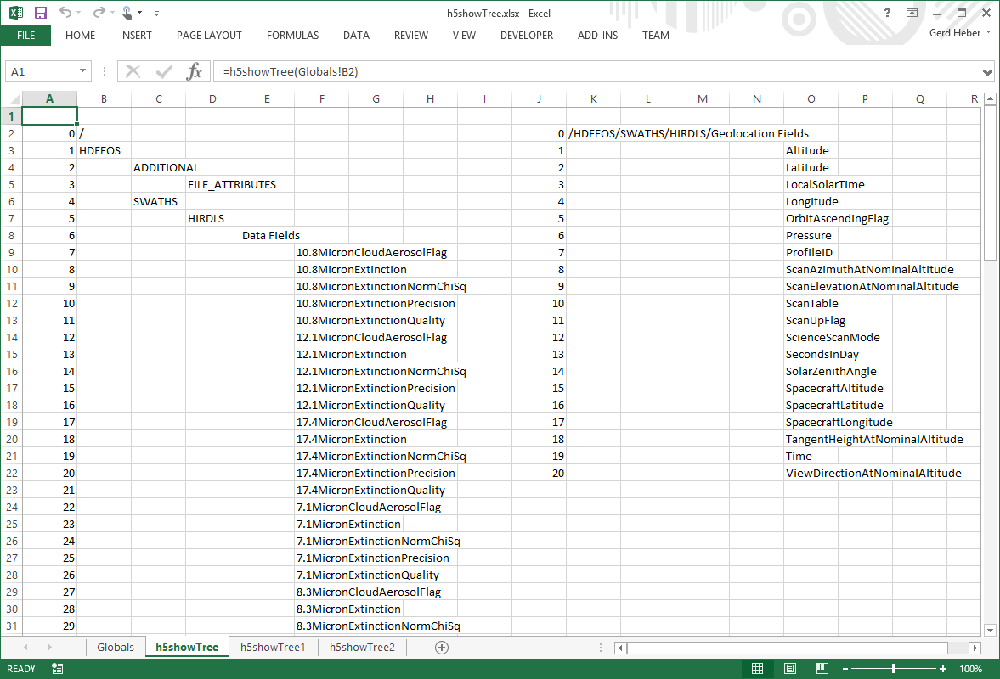

.. _h5showTree:

A Hierarchical View: ``h5showTree``
-----------------------------------

``h5showTree`` displays the contents of an HDF5 file in *hierarchical* or tree
view form. Starting at the HDF5 root group or any other HDF5 group in the
file, all reachable HDF5 objects are visited recursively. The HDF5 path names
of HDF5 objects which are "deeper" in the HDF5 group hierarchy appear on a
worksheet in cells farther to the right, which mimics a tree-view within the
confines of a worksheet.

.. _fig-h5showTree:

   Excel `h5showTree` screenshot.

.. rubric:: Excel UDF Syntax

::

  h5showTree(filename)

  h5showTree(filename [, location])

.. rubric:: Mandatory Arguments

+------------+------------------------------------------------------------+
|Argument    |Description                                                 |
+============+============================================================+
|``filename``|A text string specifying the name of an HDF5 file.          |
+------------+------------------------------------------------------------+

.. rubric:: Optional Arguments

+------------+------------------------------------------------------------+
|Argument    |Description                                                 |
+============+============================================================+
|``location``|A text string (path) specifying where to begin the traversal|
+------------+------------------------------------------------------------+

.. rubric:: Return Value

On success, ``h5showTree`` populates a range of cells with the HDF5 path names
of the objects visited.

On error, an error message (string) is returned.

.. rubric:: Examples

Display the HDF5 hierarchy starting at the path ``/HDFEOS/GRIDS`` in
file ``file.he5``.

::
   
   h5showTree("file.he5", "/HDFEOS/GRIDS")

.. rubric:: Error Conditions

The following conditions will create an error:

1. An invalid file name
   
   * An empty string or a string that contains characters not supported by
     the operating system
   * It refers to a file system location for which the user has insufficient
     access privileges
     
2. An invalid location
   
   * An empty string
   * No HDF5 object exists at the specified location

.. rubric:: See Also

:ref:`h5getInfo <h5getInfo>`, :ref:`h5showList <h5showList>`
