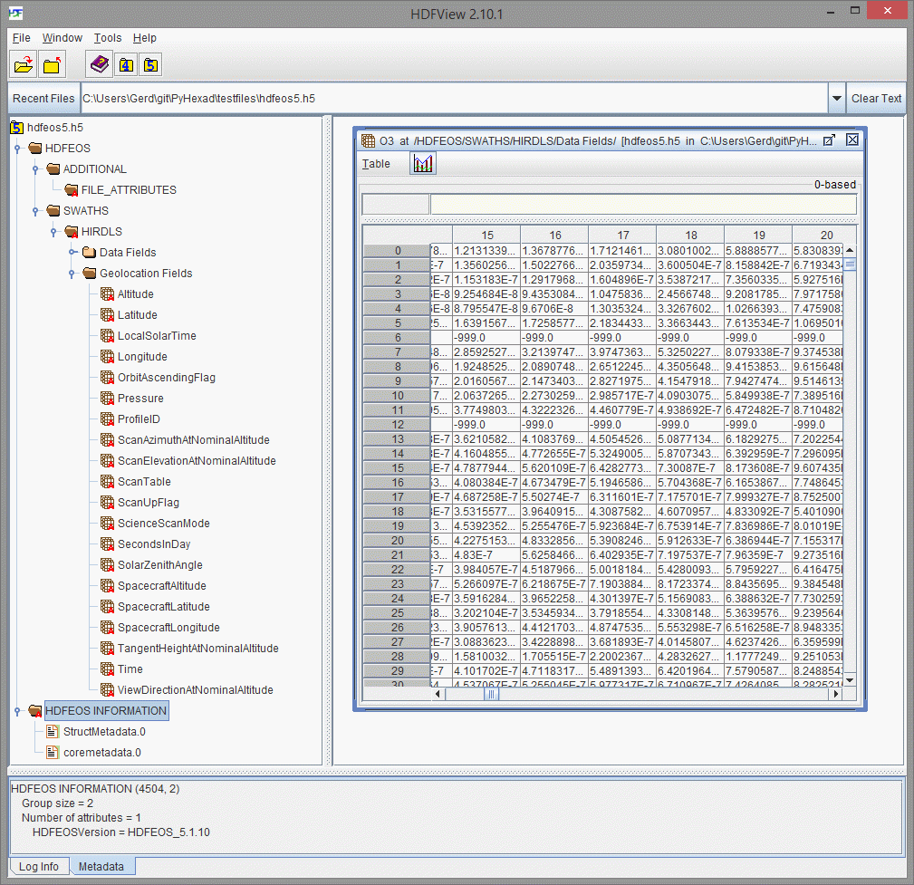

Displaying the Contents of an HDF5 File
***************************************

In figure :ref:`HDFView <fig-HDFView>`, a typical display of the contents of an HDF5 file is
shown.
	      
.. _fig-HDFView:

   HDFView screenshot.

Tools with a graphical user interface, such as [HDFView]_, usually employ some
form of treeview control to render the imaginary hierarchy of items stored in
an HDF5 file. Text-based command line tools mimic this appearance via
indentation of text labels.

Without the use of custom menus or controls, an Excel worksheet is not the ideal
medium for rendering such structures and one has to make due with the limitations
of a (coarse) rectangular grid of cells. |product| offers three functions to
explore and display information about the contents of an HDF5 file:

1. The first function, :ref:`h5showTree <h5showTree>`, populates a range of
   cells with HDF5 link names, creating an impression similar to that of
   command line tools. This is useful for a first orientation, but is of
   limited use since it offers no further event handling capabilities.

2. The second function, :ref:`h5showList <h5showList>`, offers a tabular
   representation which is enhanced by metadata such as the HDF5 datatype
   and shape of HDF5 datasets and attributes.

3. The third function, :ref:`h5getInfo <h5getInfo>`, is intended to provide
   detailed information about individual HDF5 items and their properties.

.. toctree::
   :maxdepth: 2

   h5showTree
   h5showList
   h5getInfo
