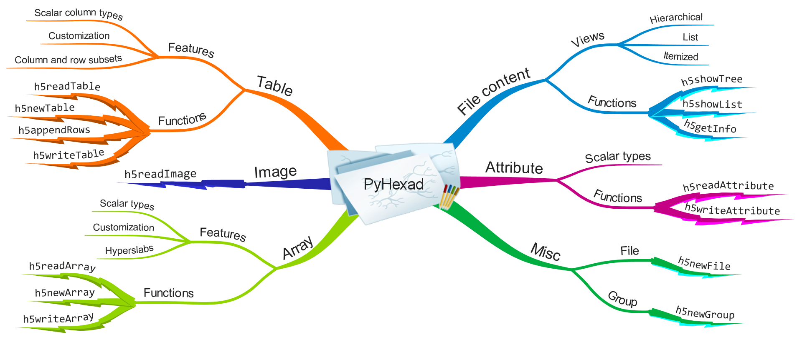

What is |product|?
==================

|product| is an Excel add-in for accessing data stored in HDF5 files.
It provides about a dozen functions (see :ref:`fig-PyHexad`)
for reading and writing data,
and to create new HDF5 items from Excel. It aims to combine the ease of
use, and convenience of Excel with the performance and efficiency of
HDF5 smart data containers.

.. _fig-PyHexad:

   An Overview of PyHexad.

In its current form, its main audience might be intermediate Excel users
who like to spice up their workbooks with Excel macros and functions,
and who might have worked with external data sources such as
relational databases. On the other end of the spectrum, for intermediate HDF5
users, a "backstairs leading to an old ideal" is open again: For a lot of data
stored in HDF5 files, a spreadsheet software such as Excel is a very nice
user interface.

Ask yourself a few simple questions:

1. Do you have a natural aversion against "hardcoding"?
2. Are you trying to automate your workbooks?
3. Does the term 'refresh dependence' mean anything to you?
4. Are you fluent in the symbology of referencing the content of cells on other worksheets, etc.?
5. Are you not easily intimidated by the huge serpent fabled to have been slain near Delphi by Apollo?

If you've answered 'yes' three or more times, we encourage you to read on.
If you are not sure about the serpent, take a look at the
`YouTube movies <https://www.youtube.com/playlist?list=PLHhSEakyiryjr5pIDiSIyFXNJnlVzlkLe>`_ and decide if PyHexad is right for you.

`Wherever you might be coming from, welcome to` |product|! Please help us
improve this product by sharing user stories, reporting issues, requesting
new features, and supporting the development.

Conventions
-----------

.. _conventions:

The syntax of the Excel functions provided by |product| is documented as
follows:

::

  h5function(A, B)

  h5function(A, B [, C, D, E])

Parameters in brackets, such as ``C``, ``D``, ``E`` in the previous example, are
**optional** parameters as opposed to mandatory parameters (``A`` and ``B``).

All parameters are **positional** parameters and must be used accordingly.
An example might help to illustrate their use. The call

::

  h5function(A, B, E)

passes ``E`` as the argument to the ``C`` position. This is quite different from

::

  h5function(A, B, , , E)

which passes ``E`` as argument in the ``E`` position. (and no arguments in the
``C`` and ``D`` positions)

Unfortunately, Excel functions have no *keyword* parameters and this is a
potential source of errors in using |product| functions.
